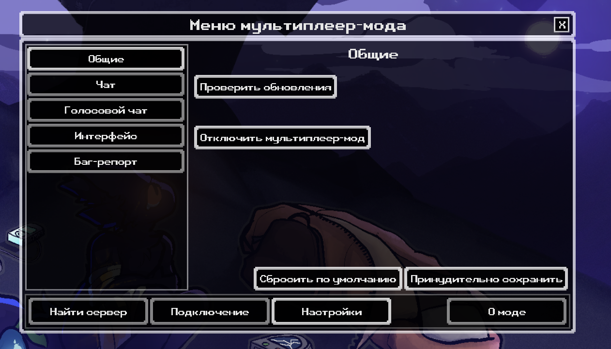
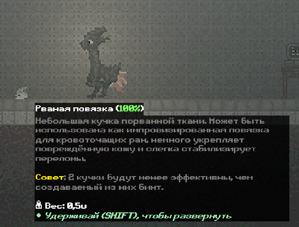
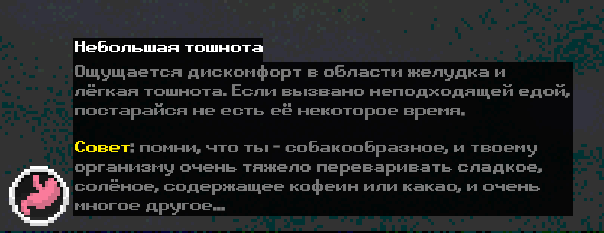
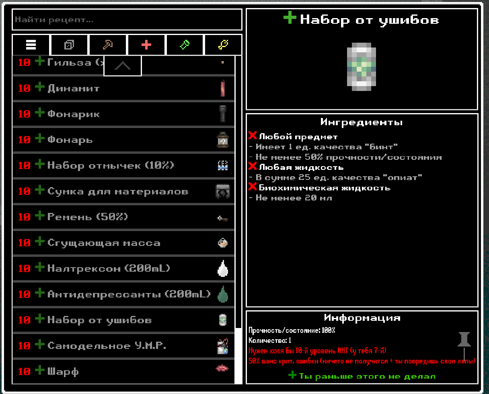
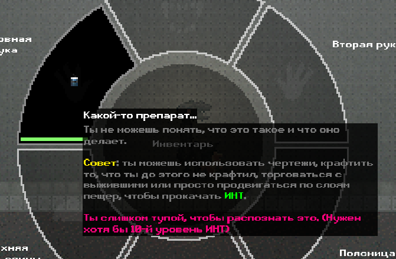
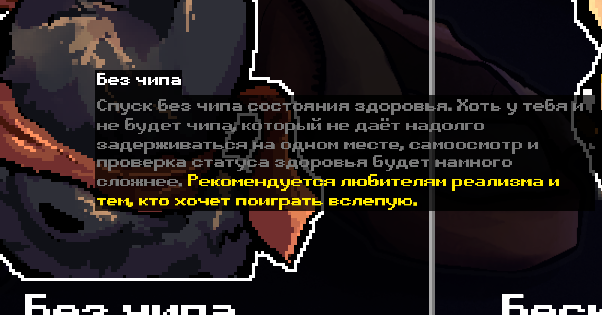

# CU-expand-russification

## ВНИМАНИЕ! Обновлений не будет до августа! (Кроме критически необходимых)

Автор сейчас занят переносом русификатора на 8 версию игры, а также разработкой русификатора для Gunsaw Genetics.(последнее - пока заброшено, пока xi0n и thepristineant не доделают английские диалоги)

## НЕ СКАЧИВАЙТЕ РУСИФИКАТОР ЧЕРЕЗ blob/main/ru-expand.json!!! ОН МОЖЕТ НЕ РАБОТАТЬ!

Вместо этого качайте через Releases (на телефонах - снизу, на ПК - справа)

В blob там находится недоделанная багованная претестовая версия русификатора для 8 версии игры

## Вкратце о русификаторе

Неофициальный расширенный перевод Casualties: Unknown от CheBuRek8176 и StragAz.

Данный русификатор ранее (в декабре-феврале, т.е. до релиза на гитхабе) использовал множество строк из другого русификатора ([Ссылка на оригинал](https://github.com/Orsoniks/scavgame-locale/pull/83)), хотя разрабатываться начал ещё в октябре

Идею "расширения" взял из очень древнего русификатора аш для demo v1, увы, ссылки нет. Его всё ещё можно найти среди первых постов на официальном сайте игры на itch.io. А идею советов взял из Project Silverfish.

**РУСИФИКАТОРКАТОР РАБОТАЕТ ТОЛЬКО НА ВЕРСИИ ИГРЫ 7.0.1**

На других версиях будут многочисленные баги.

**В настоящий момент русификатор находится в разработке, и в нём много опечаток и отсутствующих переводов. И ты можешь помочь ему! Предлагай предложения по переводу в Pull Requests, Issues, или напиши мне в Telegram/Discord (ссылка/ник [снизу](https://github.com/CheBuRek8176/CU-expand-russification#%D1%81%D0%B2%D1%8F%D0%B7%D1%8C-%D1%81-%D0%B0%D0%B2%D1%82%D0%BE%D1%80%D0%BE%D0%BC))**

## Установка

- Скачай JSON-файл (RU-expand) во вкладке Releases (Желательно Last Release, но иногда я ломаю русификатор и единственным рабочим выриантом является установка старой версии) или тыкни [сюда](https://github.com/CheBuRek8176/CU-expand-russification/releases/download/v7.0.1.3.1/RU-expand.json) (очень редко может содержать устаревшую ссылку)
- Закинь файл по пути: C:\Program Files (x86)\Steam\steamapps\common\Casualties Unknown Demo\CasualtiesUnknown_Data\Lang (если у тебя игра загружена на диск C:) ЛИБО в Стиме тыкни на CU в библиотеке, затем Управление...->Просмотреть локальные файлы->CasualtiesUnknown_Data->Lang, и в эту папку (lang) перекинь файл (изначально там уже должен быть файл EN.json)
- Зайди в игру, затем в настройки и настройки языка, после чего выбери "Русский+"
- Всё!
## Как обновить русификатор
- Выполни первые два шага по установке
- Твоя ОС должна сказать, что файл с таким именем уже существует. Нажми "заменить"/"перезаписать"/ну ты понял
- Иногда игра стирает данные папки lang. В таком случае просто установи русификатор по инструкции сверху

## Установка русификатора для Gunsaw Genetics (В РАЗРАБОТКЕ)
- Скачай JSON-файл (RU-exp-gen.json) (**ОН В РАЗРАБОТКЕ**) и **переименуй** его в ru.json (мод не хочет хавать другие названия, кроме en, cn и ru)
- Запусти игру с модом
- У тебя должен будет появиться файл в \Casualties Unknown Demo\BepInEx\config с настройками, а также папка Casualties Unknown Demo\BepInEx\plugins\GunsawGeneticsLang , последняя ставится вместе с модом (обе папки можно открыть через промотр локальных файлов в Steam)
- Закинь туда (в GunsawGeneticsLang) файл. Тебе скажут, что такой файл там уже есть. Замени его.
- Затем через конфиг (который в \Casualties Unknown Demo\BepInEx\config) замени строку `Language = en` на `Language = ru` (НЕ ДОПИСЫВАЙ .json!)

## Особенности

 - Высокое качество перевода
 - русификатор делался с душой и всего парой десятков юза гугл переводчика (я не очень хорошо знаю английский, особенно у меня страдает построение предложений и словарный запас). А не вот эти приколы, как буквально у всех - русификатор, сделанный через нейронку - это и скучно, и выглядит так себе
 - (почти) Полный перевод всего, что присутствует в игре
 - Кастомные расширенные описания, включающие советы и приколы от меня, гы)
 - Кастомные реплики персонажей. Я без понятия, зачем, но пусть будут. В основном это касается тех категорий реплик, где есть буквально по 1-2 штуки.
 - Чуть расширен лор игры. Инфу брал с [вики этой игры](https://scavprototype.wiki.gg) и [Gunsaw](https://scavprototype.wiki.gg/wiki/Gunsaw) (очень тесно связанной с CU, но, увы, заброшенной игрой).
 - Имеется частичная поддержка мультиплеер-мода. Увы, перевести прям всё не удалось, и отсутствующие переводы там имеются, но большая часть мода всё же была переведена.
 - Скоро поддержка Gunsaw Genetics!

## Скриншоты

Скриншот меню настроек мультиплеера с переводом

"Расширенное описание" повязки

"Расширенное описание" статуса "Небольшая тошнота"

Меню крафта. Обрати внимание на описание недост. ур. интелекта

Подсказка к набору опыта ИНТ

Подсказка к режиму "Без чипа"
## Важные (и не очень) ссылки

 - [Telegram-канал, где есть я](https://t.me/CasualtiesUnknown_ScavPrototype)
 - [Telegram-группа этого канала](https://t.me/+T4LYQM0mT4s1MDBi)
 - [Оригинал перевода](https://github.com/Orsoniks/scavgame-locale/pull/83), от которого, на самом деле, осталось примерно 15% переводов

## Связь с автором

 - [Мой Telegram](https://t.me/CheBuRek8176) - не стесняйся писать))
 - [Мой пост в Steam](https://steamcommunity.com/app/4576490/discussions/0/570414055657962170/) (да, там тоже можно связаться, я на него захожу довольно часто)
 - Мой ник в Discord - cheburek8176 (захожу не очень часто - раз в 2-4 часа с 2 дня до 11 вечера! (до сентября))
 - [Мой Telegram-канал](https://t.me/cu_exp_russifier), где я:
   - сру мыслями
   - спойлерю обновы русификатора
   - делюсь приколами из жизни и игры
   - там вы можете меня поддержать (за тг звёзды)
   - а вообще, он пока сыроват, но если подпишешься - буду благодарен!

## Ссылки на совместимые с русификатором моды:

- [Krokosha's Multiplayer Mod](https://github.com/Krokosha666/cas-unk-krokosha-multiplayer-coop) - Мультиплеер-мод; частичная совместимость (для версии мода v4.0.1)
- [Gunsaw Genetics](https://www.nexusmods.com/scavprototype/mods/324) - (Запланировано) Мод на персонажей из Gunsaw, пока находится в разработке, перевод временно заморожен (примерно до сентября-октября)

## Доска почёта
### Авторы
- CheBuRek8176 - ну как же себя любимого не засунуть сюда?)) а вообще, я засунул сюда себя, потому что я создатель русификатора и сделал основную его часть
- StragAz - перевёл (пока переводит) большую часть реплик Милки
### Со-авторы
Эти люди сделали свои форки русификатора, от которых я тоже что-то прихватил
- wumeya (пока ничего не брал, но планирую)
### Тестеры ранних версий русификатора (для v5pt4-v5.1):
- Roketuss (sinitsay)
- Komarok
### Тестеры более новых версий (для v6.0-v7.0.1):
- Roketuss (sinitsay) (снова)
- Day1xt
- Nagi Seishiro
### Искатели багов и опечаток:
- bibas_x2 (Монь Ферр) - нашёл проблемы с отсутствующим переводом для одного их режимов микрофона и вылезающим текстом в мультиплеер-моде (первое будет исправлено в v7.0.1.3, второе - в v7.0.1.2)
- Король Лоутаба - нашёл опечатку в обучении
### Другие:
- Gonot - хотел задонатить мне на бусти, а у меня его нет((( (но (возможно) будет). И всё равно, спасибо!
- KUZYXD - я очень долго мучался с ним (до сих пор), пытаясь разобраться с какой проблемой он столкнулся. Добавил сюда чисто по приколу и за актив на посте
## Краткая история русификатора

### До релиза на GitHub:
- 17.10.25 - начата работа над первой версией для v5pretesting4
- 11.12.25 - стащил около 1000 строк из другого русификатора (в основном записки) (опять же, позже я их перевёл уже сам)
- 20.12.25 - первая рабочая версия! (увы потерянная. получила номер v5.0.0.5.1. почти все версии до v5.1.1 потеряны, опять же, увы, да и заливать их смысла я не вижу)
- 22.12.25 - Roketuss (sinitsay) протестировал версию v5.0.0.5.2
- 10.01.26 - Начат процесс "расширения"
- 25.01.26 - последняя версия для v5pt5 (v5.0.0.5.9.1, да у неё был такой длинный номер, гы) )
- 12.04.26 - допилена стабильная версия v5.1.1 и протестирована Komarok и Roketuss
### После релиза на GitHub:
- 26.04.26 - первый релиз версии v6.0.1 и тест от Day1xt
- 10.05.26 - обнова v6.1.1
- 04.06.26 - обнова v7.0.1.0 - прямо в день релиза версии v7.0.1 игры!
- 07.06.26 - 500+ просмотров за 3 дня - СПАСИБО ОГРОМНОЕ!
- 08.06.26 - обнова v7.0.1.1
- 14.06.26 - 1000+ просмотров!
- 15.06.26 - обнова v7.0.1.2
- 16.06.26 - хотфикс v7.0.1.2.1
- 21.06.26 - 1500+ просмотров!
- 28.06.26 - 2500+ просмотров!
- 02.07.26 - обнова v7.0.1.3
- 05.07.26 - хотфикс v7.0.1.3.1 и 3500+ просмотров!
- 08.07.26 - StragAz присоединяется к разработке
- 16.07.26 - разработка русификатора для 8 версии уже завершена на 60%
- 04.08.26 - помимо внезапного добавления пары стен текста, перевод русификатора на новую систему отчёта версий (следующая версия получит номер 0.4.0, но номер 8.0.1 тоже будет валидным)
